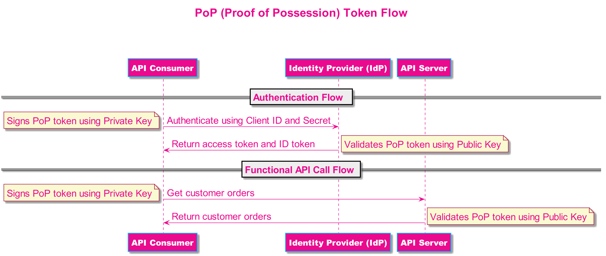

### PoP Token Libraries
Using a standard JWT as a bearer token for these flows still has the same security vulnerabilities as prior formats; attackers can still steal them or modify transactions. A stolen JWT can be used to create new requests. With TAAP, T-Mobile uses a Proof of Possession Token (PoP Token) to bind the access token to the rest of the request using a digital signature.

The format of the PoP token required by T-Mobile is:
```
Header: {alg, type} 
Body { 
  iat: <epoch time> 
  exp: <epoch time> 
  ehts: < authorization; content_type; body; uri> - Headers and fields used by client to create hash. 
  edts: <sha2 - hash of values of concatenated above Headers and fields contents passed in "ehts".> 
  jti: <unique identifier> 
  v: "v1"   
}
Signature: <digitalSignature>
```

### PoP Token Builder Library

For more information on PoP token builder library, please refer to the readme file - [PoP Token Builder Library Readme.md](./lib-tmobile-oss-poptoken-builder/readme.md)

### PoP Token Validator Library
For more information on PoP token validator library, please refer to the readme file - [PoP Token Validator Library Readme.md](./lib-tmobile-oss-poptoken-validator/readme.md)
